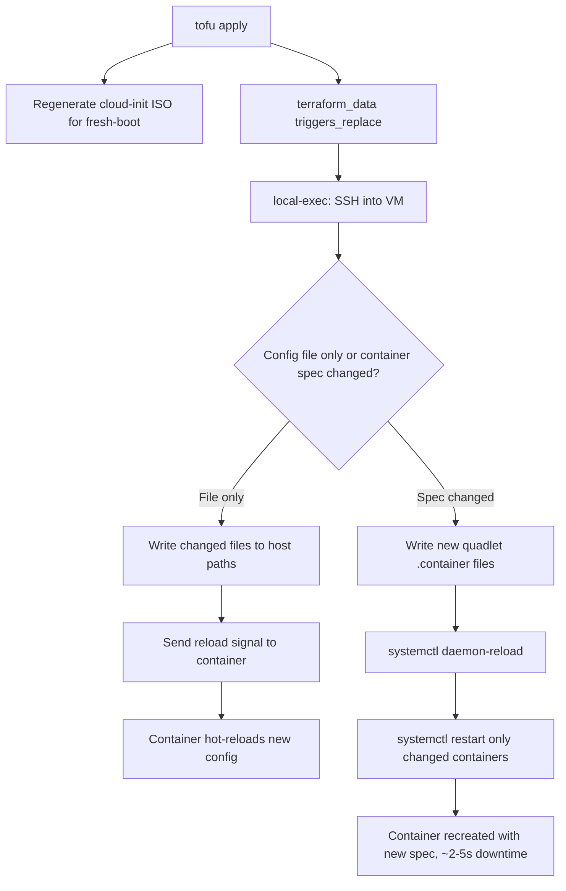

# Plan: Zero-Downtime Automatic Config Push (No Reboots, No Container Restarts)

## Problem

Cloud-init only runs on **first boot**. When `tofu apply` changes container
config, it regenerates the cloud-init ISO but the running VM never re-runs
cloud-init. The current workflow requires manual SSH to each VM.

**Requirements:**
- `tofu apply` is the single command — no manual SSH
- **No VM reboots** — zero downtime
- **No container restarts** — hot-reload only
- Pipeline runs on local machine with SSH key
- IaC is the single source of truth

## Technical Reality Check

**Not all changes are hot-reloadable.** This is a hard technical constraint,
not a design choice:

| Change type | Hot-reloadable? | Why |
|-------------|----------------|-----|
| Config files (Caddyfile, Corefile, prometheus.yml, redis.conf) | **YES** | File is bind-mounted; write + send reload signal to container |
| `extra_files` content | **YES** | Same — write to host path, visible in container immediately |
| `extra_runcmd` (one-time setup) | **N/A** | Already ran on first boot; idempotent re-run is a no-op |
| Container image tag | **NO** | A running container IS a process from a specific image; changing the image requires stopping + starting a new container |
| Environment variables | **NO** | Env vars are set at container creation; cannot be changed for a running process |
| Ports / volumes / network | **NO** | These are container creation-time parameters |
| `depends_on` ordering | **NO** | Requires container recreation to update systemd unit Wants=/After= |

**The honest truth:** Complete hot-reload with zero container restarts is
**only possible for config file changes**. Image bumps, env var changes, and
port/volume changes fundamentally require container recreation (a ~2-5s
restart of that one container — not the VM).

## Recommended Approach: Hybrid Hot-Reload + Graceful Container Recreation

### Two-mode sync script

The sync script (generated from the same tofu variables as cloud-init) detects
**what type of change** occurred and applies the least-disruptive method:

1. **Config file changed only** (no image/env/port/volume change) →
   **Hot-reload**: write the file to the host path, send a reload signal to
   the container (`podman kill -s HUP <name>` or service-specific reload
   command like `caddy reload`, `kill -USR1`).

2. **Container spec changed** (image/env/port/volume) →
   **Graceful recreation**: write the new quadlet `.container` file,
   `systemctl daemon-reload`, then `systemctl restart <name>.service`.
   This is a ~2-5s downtime for that one container only — the VM stays up.

### Architecture



### Mechanism

1. **New template** `modules/vm/sync.sh.tmpl` — renders from the same
   `var.containers`, `var.extra_files`, `var.extra_runcmd` variables.

   The script:
   - **Phase 1 — Config files**: Write each `extra_files` entry to its path
     only if content changed (compare `sha256sum`). If a file changed, check if
     a running container mounts it; if so, send the appropriate reload signal.
   - **Phase 2 — Quadlet files**: Write each `.container` / `.network` file
     only if content changed. If a `.container` changed, `daemon-reload` +
     `systemctl restart <name>.service` (graceful recreation, ~2-5s).
   - **Phase 3 — extra_runcmd**: Run each command only if it hasn't been run
     before (idempotency guard: e.g., `[[ -f /cert ]] || openssl ...`).

2. **Reload signal mapping** per container type:
   - caddy (HTTP proxy): `podman exec caddy caddy reload --config /etc/caddy/Caddyfile`
   - caddy (layer4 LB): `podman exec caddy caddy reload --config /etc/caddy/caddy.json`
   - coredns: `podman kill -s HUP coredns` (CoreDNS reloads on SIGHUP)
   - prometheus: `podman kill -s HUP prometheus` (or `curl -X POST localhost:9090/-/reload`)
   - grafana: not hot-reloadable (requires restart for config changes)
   - redis: `podman exec redis redis-cli CONFIG RELOAD` (or restart if conf changed)
   - Most others: no hot-reload mechanism → graceful restart

3. **`terraform_data` resource** in `modules/vm/main.tf`:
   ```hcl
   resource "terraform_data" "config_sync" {
     triggers_replace = [
       sha256(jsonencode(var.containers)),
       sha256(jsonencode(var.extra_files)),
       sha256(jsonencode(var.extra_runcmd)),
     ]
     provisioner "local-exec" {
       interpreter = ["/bin/bash", "-c"]
       command     = <<-SCRIPT
         # Render sync script from template, SSH into VM, execute
         ssh -o ConnectTimeout=10 -o StrictHostKeyChecking=no \
           ${var.vm_user}@${cidrhost(var.static_ip, 0)} \
           'sudo bash -s' < ${local_file.sync_script.output_path}
       SCRIPT
     }
     depends_on = [libvirt_volume.cloudinit, libvirt_domain.vm]
   }
   ```

4. **Idempotency**: The sync script checks file hashes before writing and
   container spec hashes before restarting. A re-run with no changes is a
   complete no-op.

5. **First boot**: Cloud-init handles first boot. The `terraform_data` fires
   on first apply but is idempotent (everything already matches).

### What about `extra_runcmd` one-time setup?

Commands like redis cert generation (`openssl req -x509 ...`) and NFS mount
setup (`mount /var/lib/gitea`) are one-time. The sync script wraps each in an
idempotency guard:
```bash
[[ -f /etc/infra/redis/tls/redis.crt ]] || openssl req -x509 ...
grep -qF ':/gitea /var/lib/gitea' /etc/fstab || cat ... >> /etc/fstab
mountpoint -q /var/lib/gitea || mount /var/lib/gitea
```

### Container reload signal map

| Container | Config file | Hot-reload signal | Fallback |
|-----------|------------|-------------------|----------|
| caddy (HTTP) | Caddyfile | `caddy reload --config /etc/caddy/Caddyfile` | restart |
| caddy (layer4) | caddy.json | `caddy reload --config /etc/caddy/caddy.json` | restart |
| coredns | Corefile | `kill -s HUP` (reloads zone files) | restart |
| prometheus | prometheus.yml | `kill -s HUP` or `POST /-/reload` | restart |
| alertmanager | alertmanager.yml | `kill -s HUP` | restart |
| grafana | datasource.yml | N/A (requires restart) | restart |
| ntfy | server.yml | `kill -s HUP` | restart |
| redis | redis.conf | `redis-cli CONFIG RELOAD` (limited) | restart |
| gitea | env vars only | N/A (env is creation-time) | restart |
| verdaccio | config.yaml | N/A (requires restart) | restart |
| All others | varies | N/A | restart |

**Note:** For config-file-only changes on containers with a reload signal,
zero downtime. For ALL other changes (image, env, ports, volumes, or
containers without a reload signal), a graceful ~2-5s container restart is
the minimum possible disruption.

## Implementation Plan

### Step 1: Create sync script template
- File: `modules/vm/sync.sh.tmpl`
- Renders from `var.containers`, `var.extra_files`, `var.extra_runcmd`
- Idempotent: hash-compare before write/restart
- Hot-reload signal map per container type
- Fallback to graceful restart for non-reloadable changes

### Step 2: Add `terraform_data` to VM module
- File: `modules/vm/main.tf`
- `triggers_replace` on config content hash
- `local-exec` that SSHes + runs sync script
- SSH retry loop for first-boot race
- Guard with `var.auto_sync` (default `true`)

### Step 3: Add module variables
- File: `modules/vm/variables.tf`
- `auto_sync` (bool, default `true`)
- `ssh_private_key_path` (string, default `~/.ssh/id_ed25519`)

### Step 4: Test
- Config file change → hot-reload (zero downtime)
- Image/env change → graceful restart (~2-5s, one container)
- No change → complete no-op
- First boot → cloud-init as before

### Step 5: Update README
- "just run `tofu apply` — config changes are pushed live with hot-reload
  where possible, graceful container restart for spec changes"

## Files to change

| File | Change |
|------|--------|
| `modules/vm/sync.sh.tmpl` | **NEW** — sync script template |
| `modules/vm/main.tf` | Add `terraform_data.config_sync` |
| `modules/vm/variables.tf` | Add `auto_sync`, `ssh_private_key_path` |
| `README.md` | Update rollout section |

## Honest limitation

**Image and env-var changes cannot be hot-reloaded.** A running container is
a process from a specific image with fixed env vars — changing either
requires stopping and starting a new container. This is a fundamental
containerization constraint, not something this design can work around.

For config-file-only changes (the most common day-to-day edit), hot-reload
via signal achieves true zero downtime. For image/env/port/volume changes,
a graceful ~2-5s container restart (not VM reboot) is the minimum possible.
